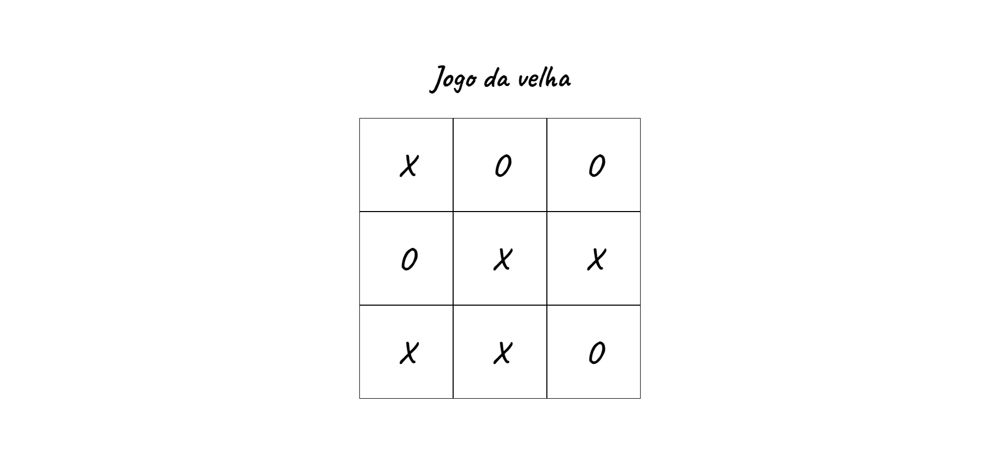

# TIC-TAC-TOE

Tic Tac Toe is a two player strategy game that is played on a 3x3 board. The object of the game is to form a line of three identical symbols (X or O) in a straight line (horizontal, vertical or diagonal) before your opponent. It's a quick and easy game to learn, suitable for all ages. It's a great pastime to challenge friends and family.

## How to Clone and Run

To clone the project repository and run it on your local machine, follow the instructions below:

1. Clone the repository using the command `git clone <repository URL>`.
2. Navigate to the project directory: `cd login-registrar-next`.
3. Install the dependencies using the command `npm install`.
4. Run the application using the command `npm run dev`.
5. Access the application in your browser at `http://localhost`.

# Preview:

